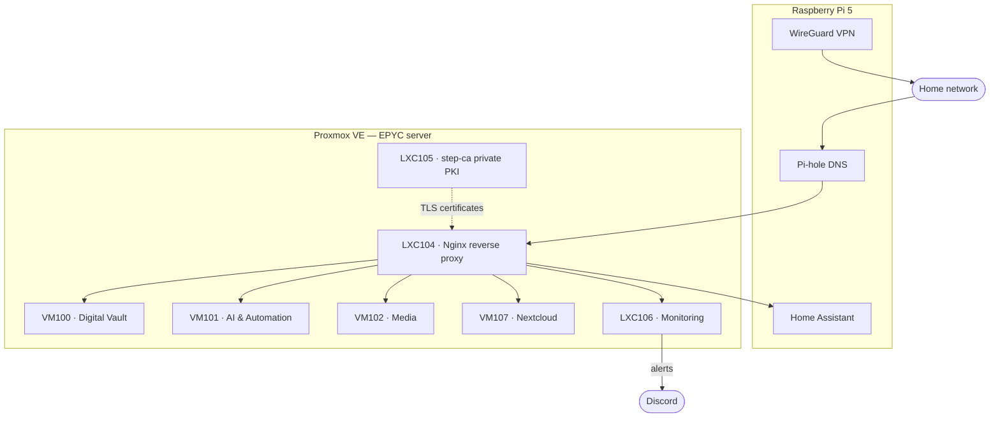

# Personal HomeLab

A self-hosted homelab built around a single AMD EPYC server running Proxmox VE, plus a Raspberry Pi 5 for network services and home automation. I use it to learn Linux, networking, virtualization and security hands-on, and to run services my family actually uses every day.

> Internal IP addresses, domains and secrets are intentionally left out of this repo.

## Hardware

| Component | Details |
|-----------|---------|
| CPU | AMD EPYC 7402P (24 cores / 48 threads) |
| Motherboard | Supermicro H12SSL-i (with IPMI) |
| RAM | 64 GB DDR4-2666 ECC RDIMM (4 × 16 GB, quad-channel) |
| GPU | NVIDIA RTX 3060 12 GB (passed through to the AI VM) |
| Boot / VM storage | Samsung 990 PRO 1 TB NVMe |
| Data storage | 2 × 8 TB HDD (ZFS mirror) · 4 TB IronWolf · 1 TB HDD (backups) |
| Cooling | Noctua NH-U9 TR4-SP3 |
| PSU | Seasonic Focus GX-850 |
| Case & rack | Lanberg 4U chassis in a Lanberg 12U closed rack, 1U PDU |
| Network | Zyxel GS1900-8 managed switch |
| Hypervisor | Proxmox VE 9 (Debian 13) |
| Extra node | Raspberry Pi 5 (4 GB) with 500 GB SSD |

## Architecture

Every service gets its own `.home` domain. Pi-hole resolves it to the reverse proxy, which terminates HTTPS with certificates from my own certificate authority.

## Virtual machines & containers

| ID | Name | Role | Status |
|----|------|------|--------|
| VM100 | Digital Vault | Vaultwarden, Paperless-ngx, Immich, Gramps Web | 🟢 Running |
| VM101 | AI-Agents | Hermes agent, Ollama (RTX 3060), SearXNG, Crawl4AI, n8n, Syncthing | 🟢 Running |
| VM102 | Media | Gluetun (VPN), qBittorrent, Prowlarr, Radarr, Sonarr, Bazarr, Jellyfin, Seerr | 🟢 Running |
| VM103 | Game server | Minecraft (All the Mods 10) | ⚪ Stopped |
| LXC104 | Reverse proxy | Nginx, HTTPS for all `.home` domains | 🟢 Running |
| LXC105 | Certificate authority | step-ca (ECC P-256 root + intermediate) | 🟢 Running |
| LXC106 | Monitoring | Prometheus, Grafana, Alertmanager, Uptime Kuma, Homarr | 🟢 Running |
| VM107 | Nextcloud | Mail, calendar and tasks in one web app | 🟢 Running |
| VM108 | Game server | 7 Days to Die | ⚪ Stopped |
| — | Raspberry Pi 5 | Pi-hole, WireGuard (wg-easy), Home Assistant (incl. energy monitoring) | 🟢 Running |

## Highlights

- **Private PKI.** My own step-ca certificate authority issues the TLS certificates, so every internal service runs on HTTPS without browser warnings.
- **Monitoring and alerting.** Prometheus scrapes node, SMART and IPMI exporters. Grafana shows disk temperatures, fans and ZFS health, and Alertmanager sends alerts (for example a degraded ZFS pool) to Discord.
- **Storage.** Important data (documents, photos, passwords) lives on a ZFS mirror of two 8 TB drives, passed through to the Digital Vault VM. Proxmox backs up every VM and container twice a week to a separate 1 TB backup drive.
- **Firewalling.** All running hosts use a default-deny firewall. Docker ports are only reachable through the reverse proxy.
- **AI agent.** A self-hosted Hermes agent ("Atlas") helps me manage the servers over SSH and keeps the documentation up to date.
- **Energy monitoring.** Home Assistant reads the P1 smart meter, smart plugs and a home battery through native integrations.
- **VPN.** WireGuard gives remote access to the home network without exposing services to the internet.

## Repository structure

| Folder | Contents |
|--------|----------|
| `infrastructure/` | Proxmox host, storage and network |
| `services/` | One page per VM or service: what it does, why, and how it's set up |

## Roadmap

- Offsite backups for the Digital Vault data
- Network segmentation with VLANs (MikroTik router + managed switch)
- Faster networking (2.5 or 10 GbE)
