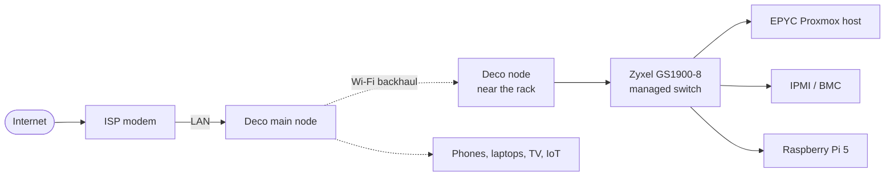

# Network

## Current layout



Everything currently sits on one flat home subnet with static addresses for the servers. The rack (EPYC host, its IPMI port and the Raspberry Pi 5) is wired to a Zyxel GS1900-8 managed switch. The switch reaches the rest of the house through a TP-Link Deco mesh node with a wireless backhaul. That wireless link is the weakest point of the network, and a wired uplink is on the roadmap.

## DNS

Pi-hole on the Raspberry Pi 5 is the DNS server for every VM and container, with a public resolver as fallback.

- Pi-hole blocks ads and trackers for the whole network.
- Pi-hole holds the local records for every `.home` domain and points them at the reverse proxy.
- The ISP router doesn't know about `.home`, so every host must use Pi-hole first. An audit found two hosts that used public DNS first and couldn't resolve internal names; both were fixed.

## Reverse proxy and HTTPS

Every web service is reached at its own `.home` domain:

```
browser → Pi-hole (resolves *.home) → Nginx on LXC104 (HTTPS) → service on its VM
```

- **Nginx (LXC104)** terminates TLS and forwards to the right VM and port, including WebSocket headers and large upload limits where a service needs them (Immich, Nextcloud).
- **step-ca (LXC105)** is my own certificate authority, with an ECC P-256 root and intermediate. It issues the certificate that Nginx uses for all `.home` domains.
- Devices trust the root certificate once, and every internal service then works over HTTPS without warnings.

Services are only reachable through the proxy. Their own ports are firewalled off from the rest of the network (see [security](security.md)).

## Remote access

WireGuard (wg-easy) on the Raspberry Pi 5 is the only way in from outside. Nothing else is port-forwarded.

- Family devices use a full tunnel, with Pi-hole as DNS.
- Friends get a split tunnel that only reaches the reverse proxy and DNS, for example to watch something on Jellyfin.

## Roadmap

- A wired uplink from the rack to the modem (replacing the Wi-Fi backhaul)
- VLAN segmentation (servers, home devices, Wi-Fi) with a MikroTik router and the managed switch
- A second internal DNS server, because `.home` names stop resolving when Pi-hole is down
- Faster networking (2.5 or 10 GbE)

## Lessons learned

- **A local DNS zone needs local DNS everywhere.** A public fallback keeps the internet working, but internal names only resolve through Pi-hole.
- **netplan in LXC containers:** `netplan apply` fails inside an LXC. Use `netplan generate` and restart `systemd-networkd` instead.
- **Casting over a VPN:** a Chromecast fetches media outside the tunnel and uses its own DNS, so it can't reach `.home`. Screen mirroring from a phone on the tunnel does work.
